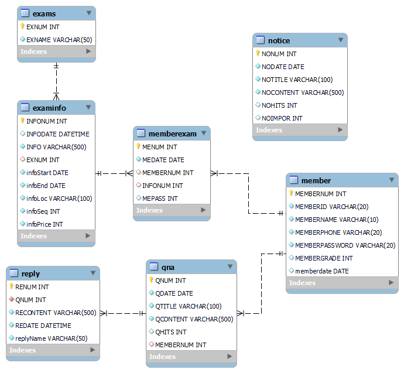

# ALLIT
**자격증 시험 접수 페이지** 입니다.   

### 개발 기간
* 2023.09.01 ~ 2023.09.15 (약 2주)  

### 팀원 구성
* **팀장 : 본인 - ERD 설계, 시험 일정 조회 기능, 시험 접수 기능, 발표, 소스 통합**
* 팀원1 : 로그인/회원가입 기능, 마이페이지 기능, 발표
* 팀원2 : 공지사항 게시판
* 팀원3 : 문의 게시판 및 댓글 기능, CSS  

### 개발 환경
* Java 11
* **프레임워크** : Spring boot(2.7.15)
* **데이터베이스** : Mysql - jdbcTemplate
* **프론트** : JSP, javascript, jQuery  

### 나의 역할
* **ERD 설계**
  
  

<b>ERD 이미지</b>

  

    
  

기획 이후 기능에 따라 어떤 데이터가 필요한지, 그 데이터마다 어떤 관계가 필요한지 생각하며 테이블과 그 관계를 구성함

* **소스 통합**

팀장으로서 역할 분담 이후 각자 작성하는 코드를 취합하고 오류를 수정함

* **기능 구현**
  

<b>시험 일정 조회 기능</b>

  

    
  

     * 시험 일정 조회 페이지에 들어가면 올해의 시험 일정이 표시
     * 기본 정렬은 날짜순
     * 시험별 검색, 기간으로 필터링, 둘 다 필터링도 가능
     * 현재 날짜에 접수 가능한 시험은 접수 버튼이 보임
     * 시험 이름이나 접수 버튼을 클릭하면 시험 상세 페이지로 이동

  

<b>시험 접수 기능</b>

  

    
  

  
     * 시험 상세 페이지에서 접수 가능
     * 현재 접수 가능한 시험만 접수 버튼이 보임
     * 접수 가능한 인원이 있고 초과되면 접수 불가능함
     * 같은 시험의 이전 회차와 다음 회차로 이동할 수 있다

  

<b>시험 관리 기능</b>

  

    
    
  

     * 관리자는 시험을 추가하고 삭제할 수 있다
     * 시험 회차는 선택한 시험에 따라 알맞는 회차가 자동으로 설정된다(이전회차 +1)
     * 관리자로 로그인하면 시험 일정 조회 페이지에서 시험을 삭제할 수 있다
